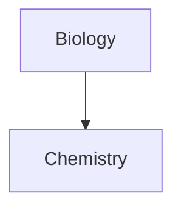

---
{"dg-publish":true,"permalink":"/home-page/","tags":["testing","gardenEntry","gardenEntry","gardenEntry","gardenEntry"]}
---


# This is a heading 1
## This is a heading 2
### This is a heading 3
#### This is a heading 4
##### This is a heading 5
###### This is a heading 6


This is an example homepage

>[!note]+ this is a callout
>This is its contents
>>[!example] his is a nested callout
>>This is the contents of it
>Now back to the original one

```ad-note
This is an admonition
```


$$
\begin{vmatrix}a & b\\
c & d
\end{vmatrix}=ad-bc
$$

**Bold text**
*Italic text*
~~strike out~~
==highlight==

[[Test Folder/Test Page\|Test Page]]

> this is a quote [^1]

- [x] This is a checked box
- [ ] This is an unchecked box


1. First list item
2. Second list item
3. Third list item


- First list item
- Second list item
- Third list item
---


| First name | Last name |
| ---------- | --------- |
| Max        | Planck    |
| Marie      | Curie     |





```js
function fancyAlert(arg) {
  if(arg) {
    $.facebox({div:'#foo'})
  }
}
```


[^1]: This is the referenced text